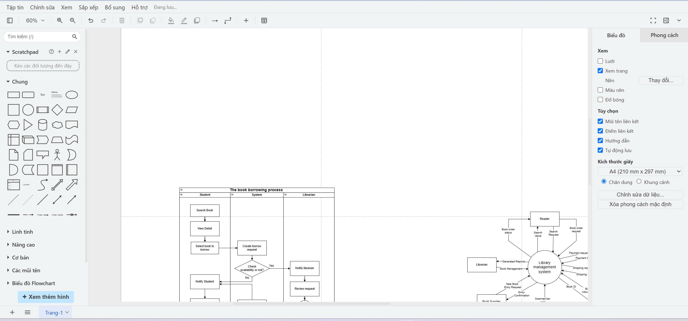

# Bloodline DNA Testing Service Management System

A comprehensive web-based management system for a DNA testing service company, providing functionality for customers, lab staff, and administrators.

## Features

### Customer Portal
- User registration and authentication
- Order DNA testing kits 
- Track sample status
- View and download test results
- Ancestry breakdown visualization
- Health insights reporting
- DNA relative matching
- Family tree building

### Administrator Dashboard
- Comprehensive reporting and analytics
- User management
- Test management
- Sample tracking
- Lab equipment and capacity monitoring
- Revenue tracking and financial reporting
- System notification management

### Lab Staff Portal
- Sample processing workflow
- Test result management
- Quality control tracking
- Equipment monitoring

## Technology Stack

- **Frontend:** HTML5, CSS3, JavaScript
- **UI Framework:** Custom CSS with responsive design
- **Charts and Visualizations:** Chart.js
- **Icons:** Font Awesome
# User Requirements for ADN Testing Service Management Software

## 1. Overview  
The software is for managing DNA (ADN) relationship testing services at a medical facility. It must support guest, customer, and staff roles, ensuring clear workflows for booking, sample collection, result delivery, and feedback.

---

## 2. User Roles

### 2.1 Guest
- **Access**: No login required.
- **Can:**
  - View homepage with introduction to the medical facility.
  - View details of DNA testing services (civil, administrative) and pricing.
  - Read blog articles: knowledge sharing, experience, testing guidance.
  - Search for information about services, procedures, and FAQs.

### 2.2 Customer (Registered User)
- **Access**: Login required.
- **Can:**
  - All guest functions.
  - Register an account, login, and manage their profile.
  - Book DNA testing services:
    - Choose between self-sampling at home or requesting staff to collect samples (at home or at facility), depending on service.
  - Manage the testing process (for civil DNA tests with self-sampling):
    - Register for appointment → Receive test kit → Collect sample → Send sample to facility → Facility performs test → Results recorded → Results delivered to customer.
  - Manage the testing process (for tests with staff collection):
    - Register for appointment → Staff collects sample and updates order → Facility performs test → Results recorded → Results delivered to customer.
  - View and download test results securely on the system.
  - View history of all test bookings and statuses.
  - Rate and provide feedback for services used.
  - Contact support or ask questions.

### 2.3 Staff (Medical Facility Staff)
- **Access**: Login required; assigned by admin.
- **Can:**
  - All customer functions (except personal feedback/rating).
  - Manage testing service information: add/edit/delete service types, pricing, instructions.
  - Manage blog content: post/edit/delete articles.
  - Manage test booking workflow:
    - Assign and update sample collection tasks.
    - Track and update sample transportation and laboratory processes.
    - Record and update test results.
    - Communicate with customers regarding status or requirements.
  - Manage user profiles and verify customer identification as needed.
  - Manage and respond to user feedback and ratings.
  - View dashboard with key statistics: number of bookings, tests in progress, completed tests, revenue, customer feedback, etc.
  - Generate and export reports (by time, service type, revenue, customer satisfaction, etc.).

---

## 3. Functional Requirements

### 3.1 Homepage
- Introduction to the medical facility.
- Summaries of DNA testing services and procedures.
- Blog/news/experience sharing section.
- Contact information and guidance for booking/testing.

### 3.2 Service Booking & Sample Collection
- Online booking with choice of self-sampling or staff-collection.
- Scheduling for sample collection (at home or at facility).
- Automated workflow tracking for each test booking.
- Notification system (SMS/email/app) at each stage: booking confirmed, kit sent, sample received, results ready, etc.

### 3.3 Test Result Management
- Secure upload, storage, and display of test results.
- Access control: only authorized users can view/download their results.
- Option to print results or request certified hard copies.

### 3.4 Service & Pricing Management (Staff Only)
- Add, edit, remove DNA testing services.
- Set and update pricing for each service.
- Manage service descriptions and instructions.

### 3.5 Blog/Knowledge Base Management (Staff Only)
- Post new articles, edit or delete existing articles.
- Organize articles by category/tag.

### 3.6 User Profile & History
- Each customer has a profile with personal info, booking history, and test results.
- Able to update contact information and password.
- Staff can view and manage user profiles.

### 3.7 Rating & Feedback
- Customers can rate services and leave feedback after receiving results.
- Staff can view, reply, and manage feedback.

### 3.8 Dashboard & Reports (Staff Only)
- Visual dashboard: number of bookings, processing status, revenue, feedback summary.
- Report generation: filter by date, type, result, revenue.

---

## 4. Non-Functional Requirements
- **Security:** Encryption of sensitive data (personal info, test results).
- **Privacy:** Only authorized users can access test results.
- **Performance:** Fast response for booking and result retrieval.
- **Scalability:** Support increasing number of users/bookings.
- **Audit Trail:** Track all actions for compliance and traceability.

---

## 5. Additional Considerations
- Mobile-friendly UI.
- Multi-language support (VN/EN).
- Integration with payment gateways for online payment (optional).
- Compliance with local regulations for medical data and privacy.

---

**End of User Requirements Document**

## Project Structure

```
/
├── index.html              # Landing page
├── login.html              # Login page
├── register.html           # Registration page
├── dashboard.html          # Customer dashboard
├── admin-dashboard.html    # Admin dashboard
├── css/
│   ├── style.css           # Main stylesheet
│   ├── auth.css            # Authentication pages styles
│   ├── dashboard.css       # Dashboard styles
│   └── admin.css           # Admin dashboard styles
├── js/
│   ├── main.js             # Main JavaScript
│   ├── auth.js             # Authentication logic
│   ├── dashboard.js        # Dashboard functionality
│   └── admin.js            # Admin dashboard functionality
└── img/                    # Image assets
```

## Installation and Setup

1. Clone the repository:
```
git clone https://github.com/yourusername/bloodline-dna-testing.git
```

2. Navigate to the project directory:
```
cd bloodline-dna-testing
```

3. Open `index.html` in your browser to view the application.

## Future Enhancements

- Backend integration with Node.js/Express or similar
- Database integration with MongoDB or PostgreSQL
- User authentication with JWT
- Real-time notifications with WebSockets
- Mobile application development
- Integration with laboratory equipment APIs
- Machine learning for DNA analysis and predictions

## License

This project is licensed under the MIT License - see the LICENSE file for details.

## Acknowledgments

- Font Awesome for the icons
- Chart.js for data visualization
- All contributors to the project 
